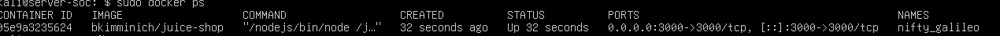
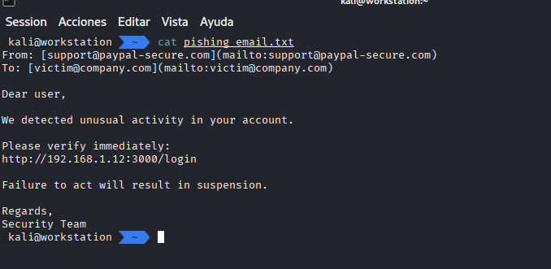
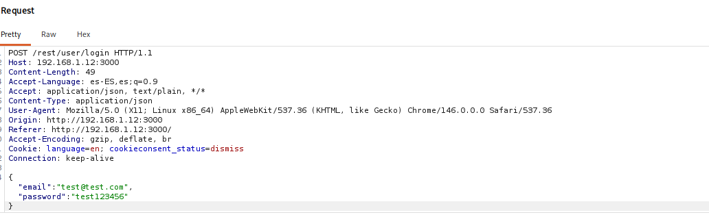
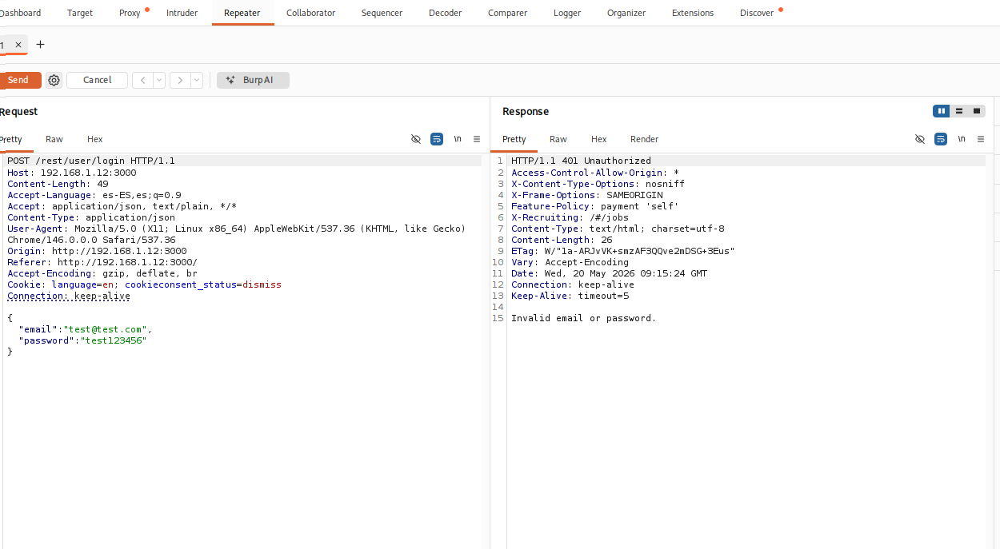

# 🛡️ Simulación y Detección de Ataque de Phishing (Entorno Controlado)

## 📌 Descripción del proyecto

Este proyecto simula un ataque de phishing en un laboratorio controlado con el objetivo de analizar el comportamiento del usuario, capturar credenciales y detectar indicadores de compromiso (IoC) desde una perspectiva SOC.

Se ha utilizado una aplicación vulnerable (OWASP Juice Shop) junto con herramientas de análisis como Burp Suite para inspeccionar el tráfico HTTP y evidenciar el ataque.

---

## 🎯 Objetivos

- Simular una campaña de phishing realista
- Analizar el comportamiento del usuario ante un enlace malicioso
- Capturar tráfico HTTP y credenciales
- Identificar indicadores de phishing
- Documentar el proceso como un caso SOC real

---

## 🧪 Entorno de laboratorio

| Máquina | Rol |
|--------|-----|
| Kali Linux | Atacante / Análisis |
| Ubuntu Server | Víctima (Juice Shop) |

---

## ⚙️ Tecnologías utilizadas

- OWASP Juice Shop
- Burp Suite
- Docker
- Kali Linux
- Ubuntu Server

---

## 🚨 Escenario del ataque

Se simula el envío de un correo de phishing que contiene un enlace hacia una página de login falsa (Juice Shop).

El usuario hace clic en el enlace e introduce credenciales, las cuales son interceptadas mediante Burp Suite.

---

## 🔍 Fases del ataque

---

### 1. Preparación del laboratorio

Se levanta el servidor vulnerable (Juice Shop) en Ubuntu.

---

### 2. Creación del phishing

Se simula un correo electrónico con enlace malicioso.

---

### 3. Interacción del usuario

El usuario hace clic en el enlace y accede a la página de login.

---

### 4. Intento de autenticación

El usuario introduce credenciales en la página falsa.

---

### 5. Verificación de conectividad

Se valida la comunicación entre máquinas dentro del laboratorio.

---

### 6. Captura de credenciales (Burp Suite)

Se intercepta la petición HTTP con las credenciales introducidas.

---

### 7. Análisis de la petición (Repeater)

Se analiza la petición en Burp Repeater para inspeccionar la respuesta del servidor.

---

## 🧠 Análisis SOC

Durante la simulación se identificaron los siguientes indicadores de compromiso:

- URL sospechosa (IP en lugar de dominio)
- Página de login no verificada
- Captura de credenciales en texto plano
- Peticiones HTTP interceptadas
- Comportamiento típico de phishing

---

## 📊 Resultados

- Se logró simular un ataque de phishing completo
- Se capturaron credenciales mediante interceptación
- Se analizaron las peticiones HTTP
- Se documentaron evidencias del ataque

---

## 🛡️ Recomendaciones

- Formación en concienciación de phishing
- Uso de autenticación multifactor (MFA)
- Implementación de filtros de correo
- Monitorización de tráfico HTTP/HTTPS
- Uso de herramientas SIEM
## 📁 Estructura del proyecto

