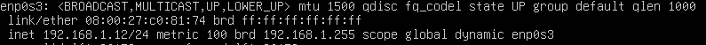
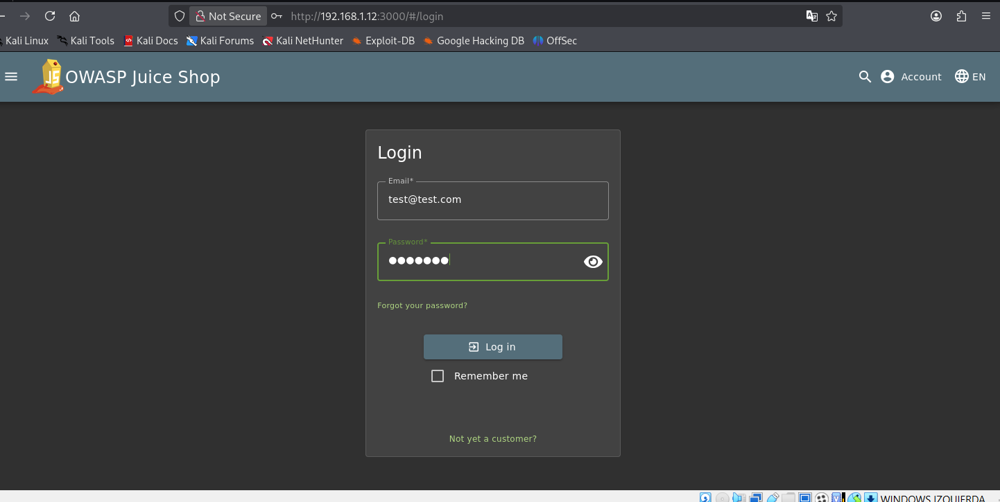
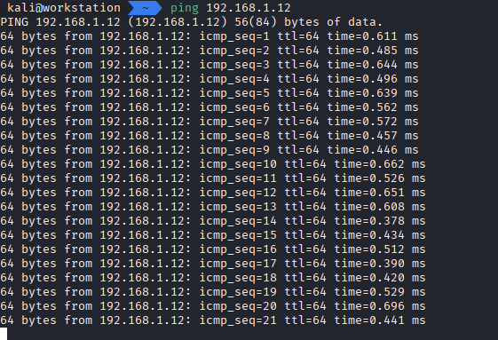

# 🛡️ Simulación y Detección de Ataque de Phishing (Entorno Controlado)

## 📌 Descripción del proyecto

Este proyecto simula un ataque de phishing en un laboratorio controlado con el objetivo de analizar el comportamiento del usuario, capturar credenciales y detectar indicadores de compromiso (IoC) desde una perspectiva SOC.

Se utiliza una aplicación vulnerable (**OWASP Juice Shop**) junto con herramientas como **Burp Suite** para inspeccionar el tráfico HTTP y evidenciar el ataque.

---

## 🎯 Objetivos

- Simular una campaña de phishing realista  
- Analizar la interacción del usuario ante enlaces maliciosos  
- Capturar tráfico HTTP y credenciales  
- Identificar indicadores de phishing  
- Documentar el proceso de ataque y análisis  

---

## 🧪 Entorno de laboratorio

| Máquina        | Rol                  |
|---------------|---------------------|
| Kali Linux    | Atacante / Análisis |
| Ubuntu Server | Víctima (Juice Shop)|

---

## ⚙️ Tecnologías utilizadas

- OWASP Juice Shop  
- Burp Suite  
- Docker  
- Kali Linux  
- Ubuntu Server  

---

## 🚨 Escenario del ataque

Se simula el envío de un correo de phishing que contiene un enlace hacia una página de login falsa.

El usuario accede al enlace e introduce sus credenciales, las cuales son interceptadas mediante un proxy (**Burp Suite**) para su análisis.

---

## 🔍 Fases del ataque

---

### 1. Preparación del laboratorio

Se despliega el servidor vulnerable (Juice Shop) en Ubuntu.

---

### 2. Creación del phishing

Se simula un correo electrónico con enlace malicioso.

---

### 3. Interacción del usuario

El usuario accede al enlace y es redirigido a la página de login.

---

### 4. Intento de autenticación

El usuario introduce credenciales en la página falsa.

---

### 5. Verificación de conectividad

Se valida la comunicación entre máquinas dentro del laboratorio.

---

### 6. Captura de credenciales (Burp Suite)

Se intercepta la petición HTTP con las credenciales introducidas.

---

### 7. Análisis de la petición (Repeater)

Se analiza la petición en Burp Repeater para inspeccionar la respuesta del servidor.

---

## 🧠 Indicadores de compromiso (IoC)

- Uso de IP en lugar de dominio  
- Página de login no verificada  
- Envío de credenciales en texto plano  
- Tráfico HTTP sin cifrar  
- Patrón típico de phishing  

---

## 📊 Resultados

- Simulación completa del ataque de phishing  
- Captura de credenciales en tránsito  
- Análisis del tráfico HTTP  
- Identificación de indicadores de compromiso  

---

## 🛡️ Recomendaciones

- Formación en concienciación de phishing  
- Uso de autenticación multifactor (MFA)  
- Implementación de HTTPS  
- Monitorización del tráfico de red  
- Uso de herramientas SIEM

